# Lab9Web
Nama   : Sayyid Sulthan Abyan

NIM    : 312410496

Kelas  : TI.24.A.5

# Langkah-langkah Latihan Praktikum
Buat file baru dengan nama **header.php**
```PHP
<!DOCTYPE html>
<html lang="en">
<head>
  <meta charset="UTF-8">
  <title>Contoh Modularisasi</title>
  <link href="style.css" rel="stylesheet" type="text/stylesheet"
  media="screen" />
</head>
<body>
  <div class="container">
    <header>
      <h1>Modularisasi Menggunakan Require</h1>
    </header>
    <nav>
      <a href="home.php">Home</a>
      <a href="about.php">Tentang</a>
      <a href="kontak.php">Kontak</a>
    </nav>
```

Buat file baru dengan nama **footer.php**
```PHP
    <footer>
      <p>&copy; 2021, Informatika, Universitas Pelita Bangsa</p>
    </footer>
  </div>
</body>
</html>
```

Buat file baru dengan nama **home.php**
```PHP
<?php require('header.php'); ?>

<div class="content">
  <h2>Ini Halaman Home</h2>
```
---
**Hasil/tampilan Web**


---


# Pertanyaan dan Tugas
Ini struktur directory yang saya gunakan:
```pgsql
project/
│
├─ asset/
│   └─ css/style.css
├─ config/
│   └─ database.php
├─ modules/
│   ├─ auth/ (login & logout)
│   └─ user/ (CRUD user/barang)
│       ├─ list.php
│       ├─ add.php
│       ├─ edit.php
│       └─ delete.php
└─ views/
    ├─ header.php
    ├─ footer.php
    ├─ dashboard.php
    └─ index.php  (router)

```
## Deskripsi Singkat
Praktikum 9 ini bertujuan untuk menerapkan **modularisasi pada PHP** dan membuat aplikasi sederhana dengan operasi **CRUD (Create, Read, Update, Delete)** menggunakan struktur folder yang terorganisir.  

Modularisasi dilakukan dengan memisahkan file menjadi beberapa bagian seperti:
- `views/` → tampilan (header, footer, dashboard, router)
- `modules/` → fitur utama (CRUD)
- `config/` → konfigurasi database
- `asset/` → file CSS/JS
- `gambar/` → tempat upload gambar barang

---

## Penjelasan Fitur Utama
**1. Dashboard**

Menampilkan halaman sambutan aplikasi.

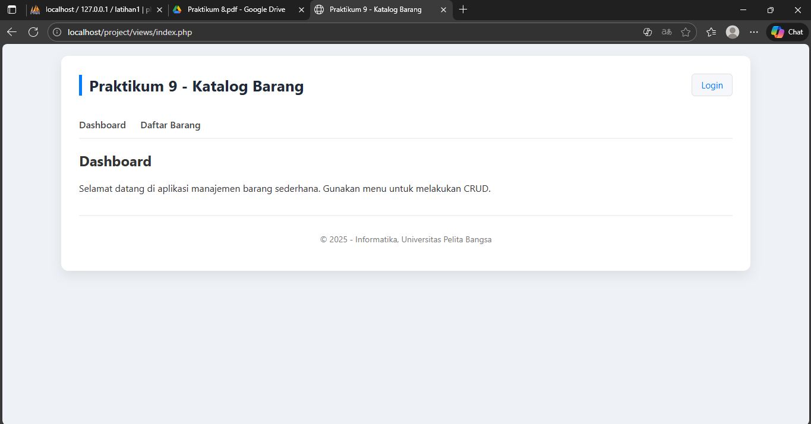

---

**2. Modularisasi**

**Semua file dipisah dalam folder:**
  - Router terpusat (views/index.php)
  - CRUD dipisahkan di modules/user/
  - Header & footer dipisah dari halaman
    
**Tujuan:**
  - Kode lebih bersih
  - Mudah diperbaiki
  - Tidak menulis template berulang
    
---

**3. Login**
Menampilkan halaman login yang berisi form login

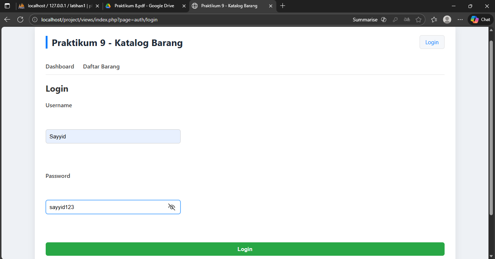

---

**4. CRUD (Create, Read, Update, Delete)**

● READ (list.php)
  - Mengambil semua data dari database
  - Menampilkan dalam tabel
  - Menampilkan gambar
  - Tombol Edit & Delete

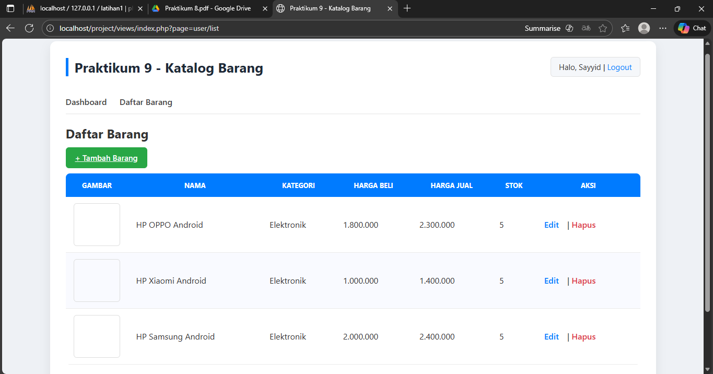

---

● CREATE (add.php)
  - Input nama, kategori, harga, stok
  - Upload gambar
  - Validasi form
  - Simpan ke database

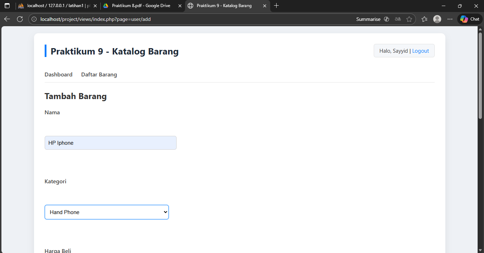

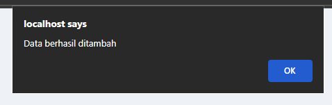
    
---

● UPDATE (edit.php)
  - Menampilkan data lama
  - Bisa mengganti gambar
  - Menghapus gambar lama saat update

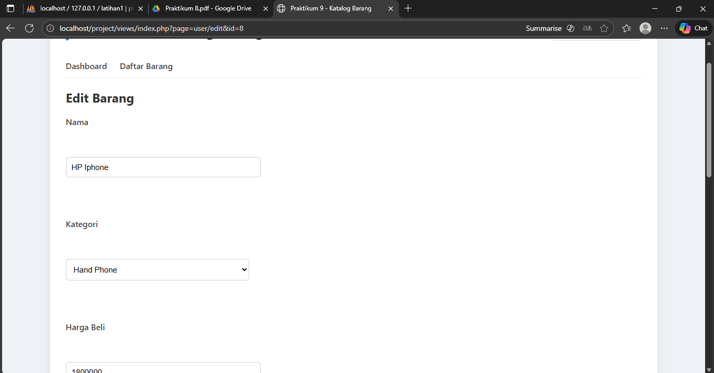
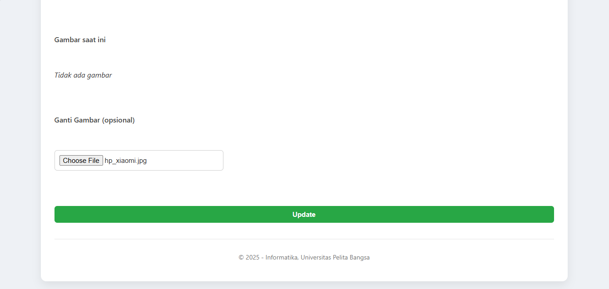
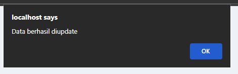

---

● DELETE (delete.php)
  - Menghapus data berdasarkan ID
  - Menghapus gambar dari folder /gambar

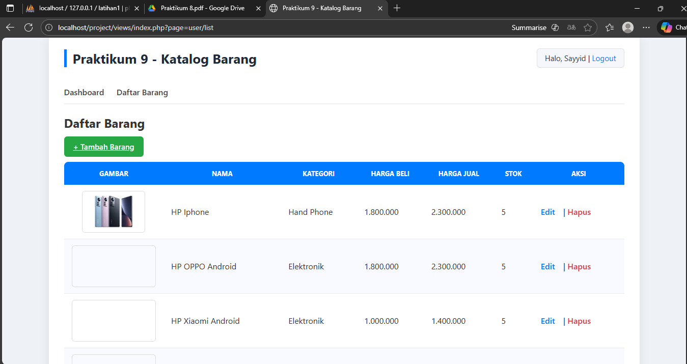 
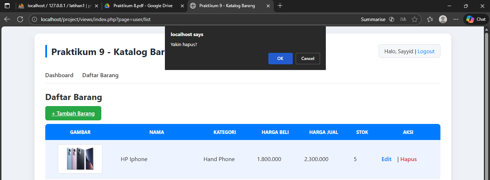
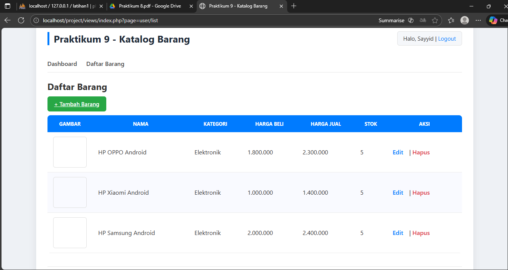
