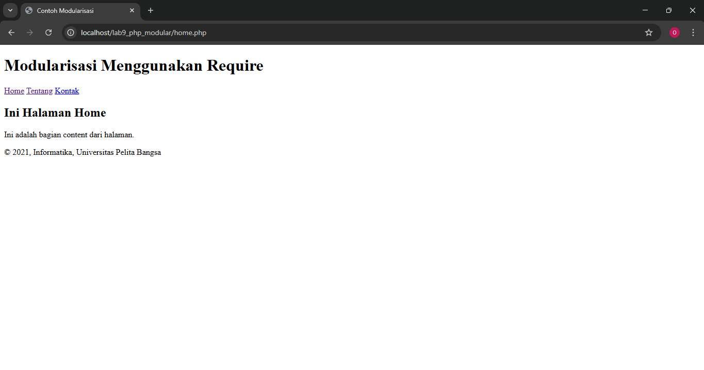
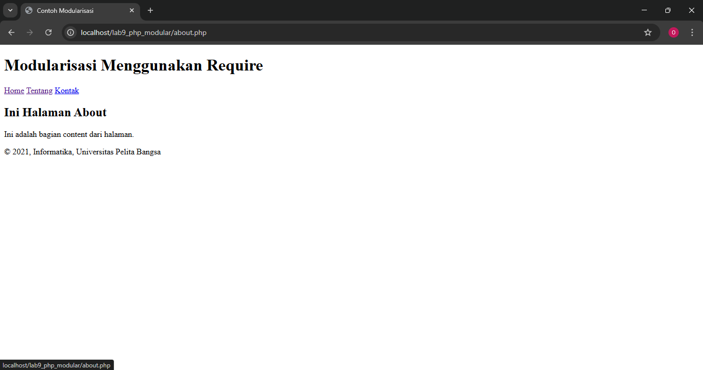

# Lab9Web
Nama   : Sayyid Sulthan Abyan

NIM    : 312410496

Kelas  : TI.24.A.5

# Langkah-langkah Latihan Praktikum
Buat file baru dengan nama **header.php**
```PHP
<!DOCTYPE html>
<html lang="en">
<head>
  <meta charset="UTF-8">
  <title>Contoh Modularisasi</title>
  <link href="style.css" rel="stylesheet" type="text/stylesheet"
  media="screen" />
</head>
<body>
  <div class="container">
    <header>
      <h1>Modularisasi Menggunakan Require</h1>
    </header>
    <nav>
      <a href="home.php">Home</a>
      <a href="about.php">Tentang</a>
      <a href="kontak.php">Kontak</a>
    </nav>
```

Buat file baru dengan nama **footer.php**
```PHP
    <footer>
      <p>&copy; 2021, Informatika, Universitas Pelita Bangsa</p>
    </footer>
  </div>
</body>
</html>
```

Buat file baru dengan nama **home.php**
```PHP
<?php require('header.php'); ?>

<div class="content">
  <h2>Ini Halaman Home</h2>
```
---
**Hasil/tampilan Web**


---


# Pertanyaan dan Tugas
Ini struktur directory yang saya gunakan:
```pgsql
project/
│
├─ asset/
│   └─ css/style.css
├─ config/
│   └─ database.php
├─ modules/
│   ├─ auth/ (login & logout)
│   └─ user/ (CRUD user/barang)
│       ├─ list.php
│       ├─ add.php
│       ├─ edit.php
│       └─ delete.php
└─ views/
    ├─ header.php
    ├─ footer.php
    ├─ dashboard.php
    └─ index.php  (router)

```
